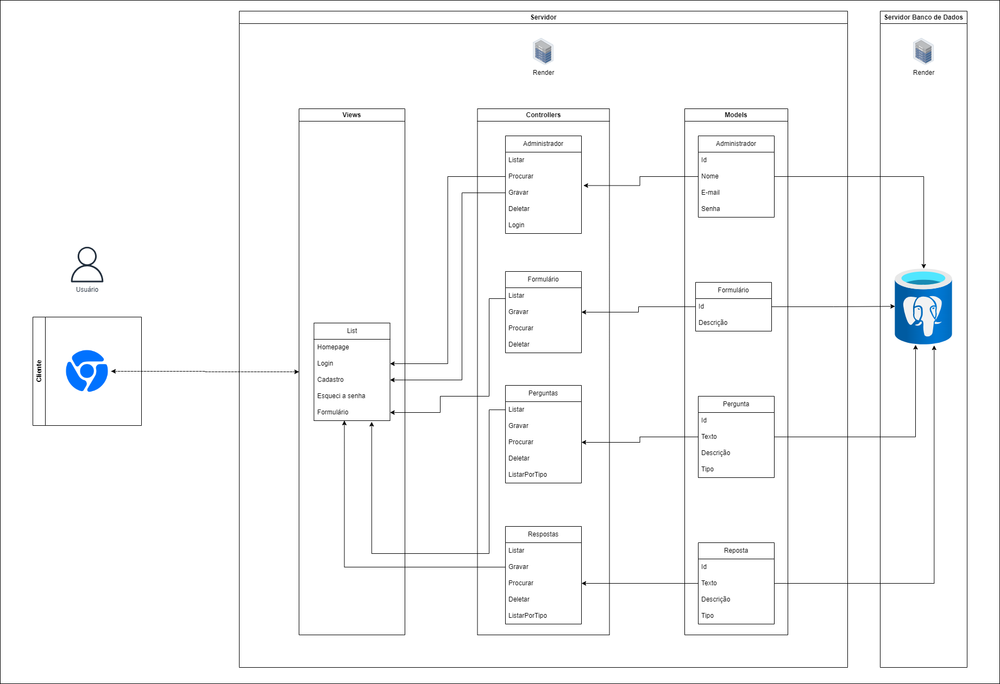

# Arquitetura MVC

## Descrição dos elementos do diagrama

Iniciando pela primeira divisão, o software é separado em banco de dados, onde o banco de dados é o local onde os dados serão armazenados, o servidor é onde toda a estrutura do nosso site ficará armazenada e o cliente é o navegador pelo qual o usuário acessa o site.

Destrinchando o servidor especificamente, temos:

#### Models

Nas Models, são definidos os modelos do software, ou seja, onde é definido as classes que devem existir e os seus respectivos atributos, no caso, foram criadas as seguintes classes:

- **Administrador:** classe que representa um usuário com permissões de administrador.
- **Perguntas:** classe que representa as perguntas que serão feitas no formulário.
- **Respostas:** classe que representa as respostas apresentadas pelo usuário durante o preenchimento do formulário.

Além disso, a model é a camada responsável por fazer a conexão com o banco de dados.

#### Controllers

Nos controllers, são criadas as funcionalidades por trás de cada classe/tabela, ou seja, no controller são criadas as funções que permitem manipular os dados do banco de dados, permitindo que funções para listar, procurar, criar, apagar e editar sejam criadas.
Cada classe possui suas funções, que se adaptam a necessidade da classe, com base nos seus atributos.

#### View

A view é a camada que corresponde a tudo que será mostrado para o usuário do site, no caso, existe uma lista com todos os componentes que poderão ser vistos e utilizados pelos usuários, sendo eles:

- Home
- Login
- Cadastro
- Formulário

# Funcionalidade

Como um todo a arquitetura do software é simples, porém prática e rápida, uma vez que não é necessária uma grande quantidade de tabelas e os dados podem ser armazenados e manipulados mais facilmente, além de que facilita as "querys" que utilizam mais de uma tabela ao mesmo tempo.