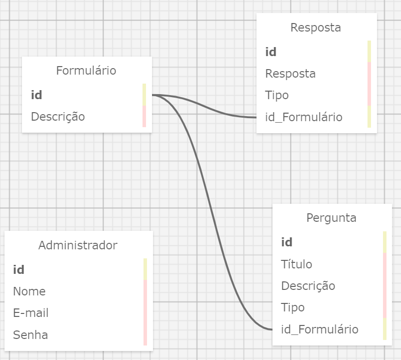

# Modelagem de banco de dados

A modelagem do banco de dados consiste em uma forma de representar a construção de um banco de dados, representando suas tabelas e colunas, além de demonstrar como cada uma delas se conecta e se relaciona.

Modelagem do banco de dados:


Arquivo XML da modelagem: [database.xml](db.xml)

# Tabelas

### Formulário

- **id**: UUID (Chave primária, identificador único)
- **Título**: TEXT (não nulo)
- **Descrição**: TEXT (não nulo)

### Administrador

- **id**: UUID (Chave primária, identificador único)
- **Nome**: TEXT (não nulo)
- **E-mail**: TEXT (não nulo)
- **Senha**: TEXT (não nulo)

### Pergunta

- **id**: UUID (Chave primária, identificador único)
- **Título**: TEXT (não nulo)
- **Descrição**: TEXT
- **Tipo**: TEXT (não nulo)
- **id_Formulário** UUID referenciando Formulário.id (Chave estrangeira, não nulo)

### Resposta

- **id**: UUID (Chave primária, identificador único)
- **Resposta**: TEXT (não nulo)
- **Tipo**: TEXT (não nulo)
- **id_Formulário** UUID referenciando Formulário.id (Chave estrangeira, não nulo)
- **id_Pergunta** UUID referenciando Pergunta.id (Chave estrangeira, não nulo)


# Relacionamentos

Existem três principais relacionamentos neste banco de dados, sendo eles:

### Formulário --> Pergunta

A tabela formulário tem uma relação de 1 pra muitos (1:N) com a tabela pergunta, isso se deve ao fato de que um formulário pode ter várias perguntas, porém cada pergunta só pode pertencer a um único formulário.

### Formulário --> Resposta

A tabela formulário tem uma relação de 1 pra muitos (1:N) com a tabela resposta, isso se deve ao fato de que um formulário pode ter várias perguntas, porém cada pergunta só pode pertencer a um único resposta.

### Pergunta --> Resposta

A tabela resposta possui uma chave estrangeira referenciando a tabela pergunta, isso acontece dentro de um modelo um para um (1:1), a principal razão dessa existência dessa chave estrangeira é para indicar qual pergunta a resposta está se referindo, ou seja, qual pergunta ela está respondendo.

# Script SQL do banco de dados

```sql
-- ---
-- Globals
-- ---

-- SET SQL_MODE="NO_AUTO_VALUE_ON_ZERO";
-- SET FOREIGN_KEY_CHECKS=0;

-- ---
-- Table 'Formulário'
-- 
-- ---

DROP TABLE IF EXISTS `Formulário`;
		
CREATE TABLE `Formulário` (
  `id` INTEGER NULL AUTO_INCREMENT DEFAULT NULL,
  `Título` MEDIUMTEXT NULL DEFAULT NULL,
  `Descrição` MEDIUMTEXT NULL DEFAULT NULL,
  PRIMARY KEY (`id`)
);

-- ---
-- Table 'Administrador'
-- 
-- ---

DROP TABLE IF EXISTS `Administrador`;
		
CREATE TABLE `Administrador` (
  `id` INTEGER NULL AUTO_INCREMENT DEFAULT NULL,
  `Nome` MEDIUMTEXT NOT NULL DEFAULT 'NULL',
  `E-mail` MEDIUMTEXT NOT NULL DEFAULT 'NULL',
  `Senha` MEDIUMTEXT NULL DEFAULT NULL,
  PRIMARY KEY (`id`)
);

-- ---
-- Table 'Pergunta'
-- 
-- ---

DROP TABLE IF EXISTS `Pergunta`;
		
CREATE TABLE `Pergunta` (
  `id` INTEGER NULL AUTO_INCREMENT DEFAULT NULL,
  `Título` MEDIUMTEXT NULL DEFAULT NULL,
  `Descrição` MEDIUMTEXT NULL DEFAULT NULL,
  `Tipo` MEDIUMTEXT NULL DEFAULT NULL,
  `id_Formulário` INTEGER NULL DEFAULT NULL,
  PRIMARY KEY (`id`)
);

-- ---
-- Table 'Resposta'
-- 
-- ---

DROP TABLE IF EXISTS `Resposta`;
		
CREATE TABLE `Resposta` (
  `id` INTEGER NULL AUTO_INCREMENT DEFAULT NULL,
  `Resposta` MEDIUMTEXT NULL DEFAULT NULL,
  `Tipo` MEDIUMTEXT NULL DEFAULT NULL,
  `id_Formulário` INTEGER NULL DEFAULT NULL,
  `id_Pergunta` INTEGER NULL DEFAULT NULL,
  PRIMARY KEY (`id`)
);

-- ---
-- Foreign Keys 
-- ---

ALTER TABLE `Pergunta` ADD FOREIGN KEY (id_Formulário) REFERENCES `Formulário` (`id`);
ALTER TABLE `Resposta` ADD FOREIGN KEY (id_Formulário) REFERENCES `Formulário` (`id`);
ALTER TABLE `Resposta` ADD FOREIGN KEY (id_Pergunta) REFERENCES `Pergunta` (`id`);

-- ---
-- Table Properties
-- ---

-- ALTER TABLE `Formulário` ENGINE=InnoDB DEFAULT CHARSET=utf8 COLLATE=utf8_bin;
-- ALTER TABLE `Administrador` ENGINE=InnoDB DEFAULT CHARSET=utf8 COLLATE=utf8_bin;
-- ALTER TABLE `Pergunta` ENGINE=InnoDB DEFAULT CHARSET=utf8 COLLATE=utf8_bin;
-- ALTER TABLE `Resposta` ENGINE=InnoDB DEFAULT CHARSET=utf8 COLLATE=utf8_bin;

-- ---
-- Test Data
-- ---

-- INSERT INTO `Formulário` (`id`,`Título`,`Descrição`) VALUES
-- ('','','');
-- INSERT INTO `Administrador` (`id`,`Nome`,`E-mail`,`Senha`) VALUES
-- ('','','','');
-- INSERT INTO `Pergunta` (`id`,`Título`,`Descrição`,`Tipo`,`id_Formulário`) VALUES
-- ('','','','','');
-- INSERT INTO `Resposta` (`id`,`Resposta`,`Tipo`,`id_Formulário`,`id_Pergunta`) VALUES
-- ('','','','','');
```
