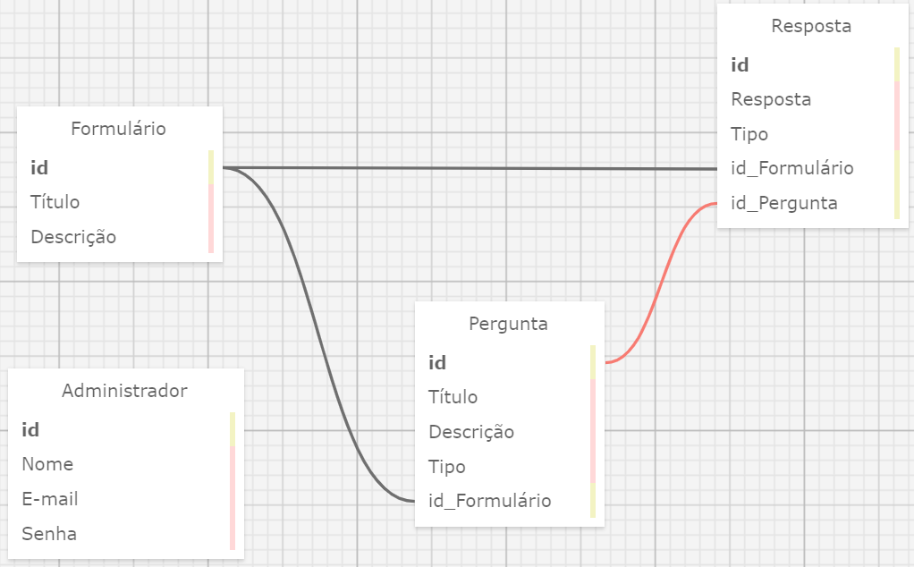

# Tabelas

### Formulário

- **id**: INTEGER (Chave primária, identificador único)
- **Descrição**: TEXT

### Administrador

- **id**: INTEGER (Chave primária, identificador único)
- **Nome**: TEXT (não nulo)
- **E-mail**: TEXT (não nulo)
- **Senha**: TEXT (não nulo)

### Pergunta

- **id**: INTEGER (Chave primária, identificador único)
- **Título**: TEXT (não nulo)
- **Descrição**: TEXT
- **Tipo**: TEXT (não nulo)
- **id_Formulário** referenciando Formulário.id (Chave estrangeira, não nulo)

### Resposta

- **id**: INTEGER (Chave primária, identificador único)
- **Resposta**: TEXT (não nulo)
- **Tipo**: TEXT (não nulo)
- **id_Formulário** referenciando Formulário.id (Chave estrangeira, não nulo)

# Relacionamentos

Existem três principais relacionamentos neste banco de dados, sendo eles:

### Formulário --> Pergunta

A tabela formulário tem uma relação de 1 pra muitos (1:N) com a tabela pergunta, isso se deve ao fato de que um formulário pode ter várias perguntas, porém cada pergunta só pode pertencer a um único formulário.

### Formulário --> Resposta

A tabela formulário tem uma relação de 1 pra muitos (1:N) com a tabela resposta, isso se deve ao fato de que um formulário pode ter várias perguntas, porém cada pergunta só pode pertencer a um único resposta.

### Pergunta --> Resposta

A tabela resposta possui uma chave estrangeira referenciando a tabela pergunta, isso acontece dentro de um modelo um para um (1:1), a principal razão dessa existência dessa chave estrangeira é para indicar qual pergunta a resposta está se referindo, ou seja, qual pergunta ela está respondendo.
